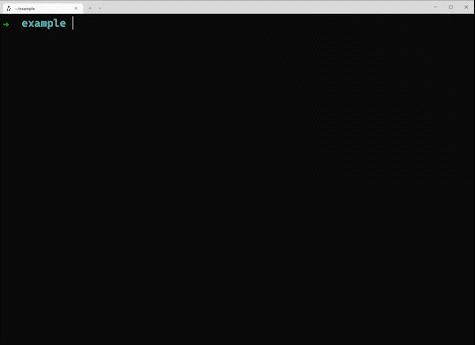

# create-that-app
A cli that displays a list of starters to select from, for the forgetful like me. Currently has popular options, feel free to make a PR or issue if you want one added.



## Run
Use your favourite package runner

### npm

```bash
npx create-that-app@latest
```

### yarn

```bash
yarn create that-app
```

### pnpm

```bash
pnpm -s dlx create-that-app@latest
```
